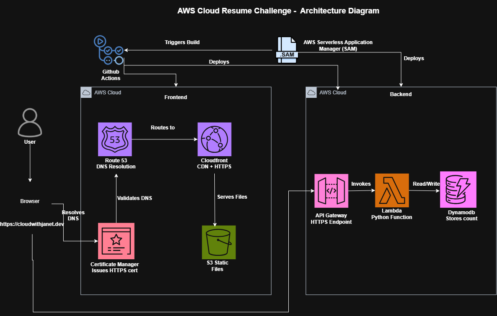

# Cloud Resume Challenge — AWS Serverless Resume

My submission for [Forrest Brazeau's Cloud Resume Challenge](https://cloudresumechallenge.dev/docs/the-challenge/aws/): a fully serverless resume site on AWS, with a live visitor counter, infrastructure defined as code, and automated CI/CD.

**Live site:** cloudwithjanet.dev
**Blog writeup:** https://medium.com/@onegkuj/the-complete-aws-cloud-resume-challenge-walkthrough-s3-cloudfront-lambda-sam-ci-cd-9f8db2ce6f34

## Architecture



This project is two independent flows:

- **Frontend:** Route 53 → CloudFront → S3 (private bucket, locked down with Origin Access Control)
- **Backend:** Browser JS → API Gateway → Lambda → DynamoDB

## Tech Stack

| Layer | Technology |
|---|---|
| Static hosting | Amazon S3 (private, via OAC) |
| CDN / HTTPS | Amazon CloudFront |
| DNS | Amazon Route 53 |
| Certificates | AWS Certificate Manager (ACM) |
| API | Amazon API Gateway |
| Compute | AWS Lambda (Python 3.12) |
| Database | Amazon DynamoDB |
| IaC | AWS SAM (Serverless Application Model) |
| Testing | pytest + moto |
| CI/CD | GitHub Actions |

## Repository Structure

```
.
├── .github/
│   └── workflows/
│       ├── frontend.yaml       # Syncs frontend/ to S3, invalidates CloudFront
│       └── backend.yaml        # Validates, tests, and deploys the SAM stack
├── frontend/
│   ├── index.html
│   ├── style.css
│   └── script.js
└── backend/
    └── cloudresume-challenge/
        ├── template.yaml       # SAM template — defines DynamoDB, Lambda, API Gateway
        ├── samconfig.toml      # Saved deploy configuration
        ├── hello_world/
        │   ├── app.py          # Lambda handler
        │   └── requirements.txt
        └── tests/
            └── unit/
                └── test_app.py # pytest + moto unit tests
```

## Prerequisites

Before setting this up on your own machine, you'll need:

- An AWS account
- [AWS CLI](https://docs.aws.amazon.com/cli/latest/userguide/getting-started-install.html) installed and configured (`aws configure`)
- [AWS SAM CLI](https://docs.aws.amazon.com/serverless-application-model/latest/developerguide/install-sam-cli.html) installed
- Python 3.12
- Node.js (only needed if you plan to use the AWS CDK or local tooling — otherwise not required)
- A registered domain name (this project uses one purchased through name.com, but any registrar works)
- Git

## Setup Instructions

### 1. Clone the repository

```bash
git clone https://github.com/YOUR-USERNAME/YOUR-REPO-NAME.git
cd YOUR-REPO-NAME
```

### 2. Frontend Setup

1. Create an S3 bucket to hold the static site files.
2. Keep **Block all public access** enabled — this project uses Origin Access Control (OAC), not a public bucket.
3. Create a CloudFront distribution:
   - Origin: your S3 bucket's REST endpoint
   - Origin Access: Origin Access Control (create a new OAC)
   - Viewer Protocol Policy: Redirect HTTP to HTTPS
4. Copy the bucket policy CloudFront generates and paste it into your S3 bucket's policy.
5. Request a certificate in **ACM (us-east-1 region specifically)** for your domain, and attach it to your CloudFront distribution under Alternate Domain Names.
6. Create a CloudFront Function (see `frontend/index-rewrite-function.js` if included, or the snippet in the blog writeup) to handle the root-path routing that OAC's REST endpoint doesn't do automatically. Attach it to your distribution's default behavior under Viewer Request.
7. In Route 53, create a Hosted Zone for your domain, update your registrar's nameservers to point to it, then add an A (Alias) record pointing your domain at the CloudFront distribution.

### 3. Backend Setup

```bash
cd backend/cloudresume-challenge

# Validate the template
sam validate

# Build
sam build

# First deploy (interactive — saves your answers to samconfig.toml)
sam deploy --guided
```

When prompted, confirm it's okay for the API to have no authentication (correct for a public visitor counter).

After deployment, SAM prints your API Gateway endpoint URL — you'll need this for the frontend.

### 4. Wire the Frontend to the Backend

In `frontend/script.js`, set `API_URL` to the endpoint SAM printed in the previous step:

```javascript
const API_URL = "https://your-api-id.execute-api.your-region.amazonaws.com/Prod/count";
```

Then upload `frontend/` to your S3 bucket, and create a CloudFront invalidation (`/*`) so the change is visible immediately.

### 5. Run the Tests

```bash
cd backend/cloudresume-challenge
pip install pytest moto --break-system-packages
pytest tests/unit
```

## Environment Variables

The Lambda function reads its DynamoDB table name from an environment variable rather than a hardcoded string, set automatically by SAM via `template.yaml`:

```yaml
Environment:
  Variables:
    TABLE_NAME: !Ref VisitorCountTable
```

No manual `.env` file is needed — SAM injects this at deploy time.

## CI/CD

Two independent GitHub Actions workflows, each triggered only by changes to their respective folder:

- **`frontend.yaml`** — syncs `frontend/` to S3 and invalidates CloudFront
- **`backend.yaml`** — validates the SAM template, runs unit tests, and deploys via `sam deploy` if tests pass

Both authenticate to AWS using IAM access keys stored as encrypted GitHub repository secrets:

| Secret | Purpose |
|---|---|
| `AWS_ACCESS_KEY_ID` | IAM user access key |
| `AWS_SECRET_ACCESS_KEY` | IAM user secret key |

| Variable | Purpose |
|---|---|
| `AWS_REGION` | Deployment region |
| `S3_BUCKET_NAME` | Frontend bucket name |
| `CLOUDFRONT_DISTRIBUTION_ID` | For cache invalidation |

Each pipeline's IAM permissions are scoped to least privilege — the frontend pipeline can only touch its specific S3 bucket and CloudFront distribution.

## What I Learned

Full writeup with architecture decisions, real errors encountered, and how each was resolved: https://medium.com/@onegkuj/the-complete-aws-cloud-resume-challenge-walkthrough-s3-cloudfront-lambda-sam-ci-cd-9f8db2ce6f34
I'd be happy to connect!: linkedin.com/in/janet-wanjiku
